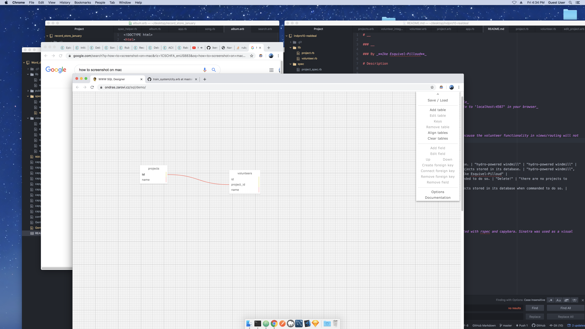

# __

### __

### By _**Ike Esquivel-Pilloud**_

# Description

__

### Setup/Installation Requirements

* _1: download this application from github_
* _2: navigate to the file through the terminal_
* _3: type 'gem install' and 'bundle' into the console_
* _4: type 'ruby app.rb' into the console and navigate to 'localhost:4567' in your browser_

# dump code

# database visual

# Known Bugs

_21 of 22 specs will pass. The final one will not, because the volunteer functionality in views/routing will not function._

# specs
| Behavior        | Input           | Outcome  |
| ------------- |:-------------:| -----:|
| The program will store a project within its database. | "hydro-powered windmill" | "hydro-powered windmill" |
| The program will store a list of volunteers for projects stored in its database. | "hydro-powered windmill", "Ike Esquivel-Pilloud" | "hydro-powered windmill", "Ike Esquivel-Pilloud" |
| The program will delete/update projects when commanded to do so. | "Delete!" | "there are no projects to display" |
| The program will delete/update volunteers for projects stored in its database when commanded to do so. | "Update!" | "Isaac Esquivel-Pilloud" |

### Support and contact details

_ike.esquivelpilloud@gmail.com_

### Technologies Used

_the program as written in ruby, using atom, and tested with rspec and capybara. Sinatra was used as a visual guide in the development of this project._

### Gems used:

-'pry'
-'rspec'
-'sinatra'
-'capybara'
-'sinatra-contrib'

# License

_MIT licensing_

Copyright (c) 2019 **_Ike Esquivel-Pilloud_**
